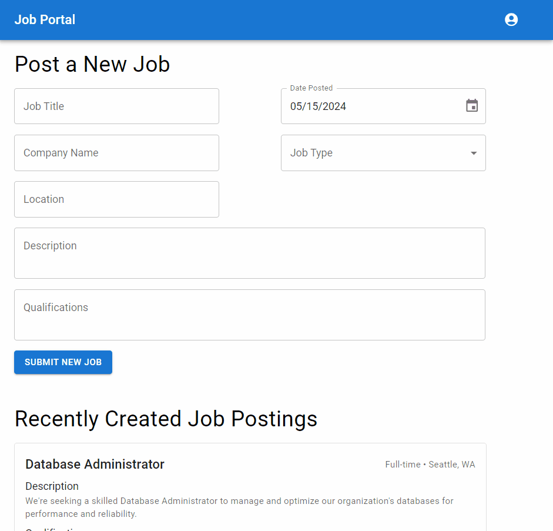
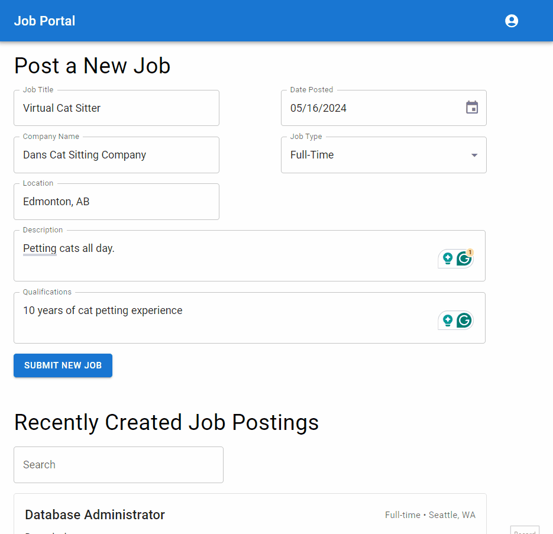

# Assignment 3 - Job Posting Form

This assessment consists of using MUI form elements to create a job posting form.

You will be assessed on your knowledge of the following:
- MUI form elements
- Form validation
- Error Handling
- Form State Management

## Steps

1. Install the dependencies by running `npm install`, take a look at the `index.js` file in the `pages` directory, and take a look at the `CreateJobForm` component in the `components` directory.

2. Using React state and MUI form elements, [control](https://react.dev/reference/react-dom/components/input#controlling-an-input-with-a-state-variable) each input field in the form `CreateJobForm` component.
    - You should have controlled inputs for all of the following inputs:
       - Title
       - Company Name
       - Description
       - Location
       - Type
       - Qualifications
       - Date Posted
    - Note that you may find the following documentation useful.
      - [TextField](https://mui.com/material-ui/react-text-field/)
      - [Select](https://mui.com/material-ui/react-select/)
      - [Date Picker](https://mui.com/x/react-date-pickers/date-picker/#uncontrolled-vs-controlled-value)
      - [The package: dayjs]
        - Note you'll probably need the following `.format('YYYY-MM-DD')` to convert a `dayjs` object to a string for formatting. [More docs here](https://day.js.org/docs/en/display/format#docsNav)
        - Note for the date validation you'll probably need to use the `isBefore` method. [More docs here](https://day.js.org/docs/en/query/is-same-or-before#docsNav).
          - You might need `iAfter` instead depending on the implementation. [More docs here](https://day.js.org/docs/en/query/is-after#docsNav)

3. Validate the form and ensure that the following fields, return an error if they are not valid, display that error under the "submit" button of the form.
 - Title
   - needs to be at least 10 characters
   - Error message: "Title must be at least 10 characters"
 - Company
   - can't be empty
   - Error message: "Company Name is required"
 - Description
   - can't be empty
   - Error message: "Description is required"
 - Location
   - can't be empty
   - Error message: "Location is required"
 - Type
   - needs to be one of the following: Full-time, Part-time, Contract
   - Error message: "Type must be one of the following: Full-time, Part-time, Contract"
 - Qualifications
   - can't be empty
   - Error message: "Qualifications is required"
 - Date Posted
   - can't be posted before today's date.
   - Error message: "Date Posted must be in the future"

4. Display an error message for each field that is not valid.
    - This should list the validation errors for each field that is not valid in an [Alert](https://mui.com/material-ui/react-alert/) beneath the `Grid` in the `form`. Please take a look at the overview of functionality for an example of how this should look.
      - Note: there should be one error per line.
    - You'll also need to use your conditional JSX rendering knowledge for this step.

Note: please refer to the Expected Output/Functionality section for an example of how this should look.

5.  Create and use state in the `index.js` and _share_ it with the child component(s). If the above `CreateJobForm` component is valid the job should get added to the list of jobs and shown in the `RecentlyCreatedJobList` component. The form should be reset after the job is added to the list.
  - The Job should only be added to the list if the form is valid (see above steps on the form validation).
  - For documentation on how to pass state to child components, you can refer to the following [documentation](https://react.dev/learn/sharing-state-between-components).
  - Note: for the tests to run properly please use the prop name `setJobs` in the `CreateJobForm` to pass the state to the child component.

## Expected Output/Functionality

The form validation should work as follows:

## Bonus (only attempt this if you are done with the above steps)
Create a search bar that will search through "Recently Create Job Postings". The output should be the same as the functionality shown in the gif below.

## Challenges (only attempt this if you have way too much time on your hands, no grades for this.)
1. Change the form so that it uses a react stepper component to break the form into multiple steps You can refer to the [MUI Stepper Documentation here](https://mui.com/material-ui/react-stepper/). Sample:
- Step 1 company information: 
  - Company Name and Location
- Step 2 job information:
  - Job title. Job Type, and Date Posted
- Step 3 job details:
  - Job Description and Qualifications

Note: please do not ask your instructor for help on this. This is a challenge for you to attempt if you have extra time and want to learn more about React.

2. Use the [zod](https://zod.dev/) library for validation and also display errors on each input.

## Marking Key

| Marks | Tasks |
|------------------|------------------|
| 5 | State used correctly in the `CreateJobForm` form component. This includes proper imports, properly controlling inputs and initializing with the correct values. |
| 5 | Form validation is implemented correctly to the spec above |
| 5 | Error Message is displayed at the correct times and in the correct format. Job is only added if the form is valid. |
| 1 | Form is reset after the job is adding to the list |
| 3 | State shared correctly with the child components. Job is added to the list of jobs and shown in the `RecentlyCreatedJobList` component. |
| -5 | Project runs without errors, and functionality looks like the images provided. |
| -3 | Code is clean and well-organized, and components created in the right location |
| 3 (bonus) | Job can be filtered in the "Recently Create Job Postings", state is handled properly, and `useEffect` not used (partial marks if used). |

## Marking Rubric
### 5 marks
| Marks | 5 marks Criteria |
|------------------|------------------|
| 5 | Task was completed with the highest of proficiency adhering to best practices and followed subject matter guidelines all tasks were completed to a professional standard. |
| 4 | Task was completed well some minor mistakes. Well above average work shows good understanding of the task and high degree of competence |
| 3  | Satisfactory work some features missing or incorrectly implemented. Show a moderate level of understanding in the task with room for improvement. |
| 2  | Below average work. Task was poorly complete. Show understanding of the task and the requirements to implement but implementation was poorly executed. |
| 1  | Some of the task was completed. Showed a lack of understanding in the subject matter and very poorly executed. |
| 0  | Not completed. |

### 3 marks
| Marks | 3 marks Criteria |
|------------------|------------------|
| 3 | Proficient shows a high degree of competence in completing task. |
| 2 | Capable, above-average degree of competence in completing the task. |
| 1 | Satisfactory shows a satisfactory degree of competence in completing the task. | 
| 0 | Shows a limited degree of competence in completing the task. |
 
### 2 marks

| Marks | 2 marks Criteria |
|------------------|------------------|
| 1 | Task Completed satisfactorily   |
| 0 | Task was not executed. |

### Negative Marks

Negative marks will be given for the assignment at the discretion of the instructor with a maximum of -5 marks for this assignment. The default will be 0 if it is correct.
